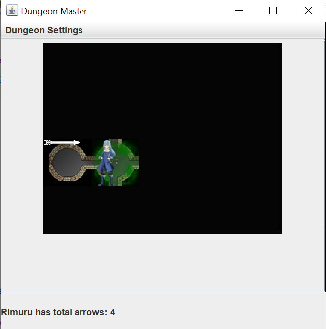

### About/Overview
The project simulates a game where the player maneuvers through a dungeon. For the console game - a text based controller is used to interact with the user. For the GUI game - a keyboard listener, mouselistener and buttonlistener is mapped. A read only model is given to the view. 

The dungeon is implemented as an interface which interacts with the driver. The Kruskal algorithm creates the dungeon represented as a graph. Every node is connected to every other node. The dungeon consists of caves and tunnels. Tunnels are caves with 2 entrances. Interconnectivity is added later. Additionally, the dungeon can have wrapping nodes. The player has the ability to move from cave to cave. Caves have treasure which the player can pick. Arrows are present at each location for the player to pick. Caves also contain monsters called Otyughs. Otyughs can be killed by shooting arrows (one hit only reduces 50% of Otyugh's health). The player is killed instantly and the game ends if they enter a cave with an Otyugh. The game also ends when player reaches the end location without being killed.

### List of Features
1. The dungeon has 2 types of locations- Cave and Tunnel.
2. A cave can have 1, 3 or 4 entrances and can hold treasure.
3. A tunnel can only have 2 entrances and cannot hold any treasure but can hold arrows.
4. Creating dungeon from Kruskal’s algorithm.
5. Adding interconnectivity.
6. Wrapping dungeon.
7. Start and End location are randomly determined and the distance between them is atleast 5.
8. Player can choose to move, pickup, shoot or quit.
9. Player can choose which direction to move.
10. Player can specify the distance and direction to shoot.
11. Player can choose to pick arrow or treasure from caves.
12. There are Otyughs spread out through the dungeon in caves. There will
    always be an Otyugh in the end location and never at the start.
13. Otyughs can kill the player instantly if the player enters a cave with an Otyugh.
14. Otyughs are extremely smelly creatures. The player can smell varying intensities of smell based
    on how far the Otyugh is from his location. If an Otyugh is in the next location, the player
    gets an intense smell. If there are multiple Otyughs, within 2 positions of the player, the
    player again gets a high smell. If there is a single Otyugh 2 positions away, the player gets a
    low intensity smell.
15. The player can slay Otyughs using arrows. The
    player starts with 3 arrows.
16. The arrows can injure an Otyugh if they lie at the exact distance for which the arrow is fired.
17. An Otyugh needs to be hit twice with arrows to kill it. If the Otyugh is injured and the player
    enters the location, they have a 50% chance to escape the monster.
18. The arrows can travel in a straight line through caves and can move freely through the tunnels.
    If the straight line distance does not exist in the cave, then the arrow is stopped at the
    location and is wasted.
19. The GUI reveals the dungeon caves as the player visits them.
20. The GUI shows the treasure, arows of the player's current and visited locations.
21. The GUI has a menu with following features:
    1. The player can see their statistics: treasure and arrows collected.
    2. The player can reset the game ie. reuse the same dungeon with all same dungeon items.
    3. The player can start a new game ie. provide parameters for a new dungeon.
    4. When new game is clicked, the previous game settings are loaded so the user can reuse those parameters.
    5. The player can exit the game.
22. The player can move via keyboard and clicks.

### Extra Credit Features
1. Dungeon has a pit. The sound is an indicator showing if a pit is nearby. If the player falls in it, the game ends.
2. Dungeon has a thief. If the player encounters a thief all their treasure is lost.
3. Dungeon has a moving monster - Giant. The giant moves randomly.
4. If the player encounters a Giant:
    1. If the player has more than 4 arrows then they can choose to trade 4 arrows for a Giant killing potion and defeat the Giant or take a risk and pass the Giant then they will have a 50% chance of survival.
    2. If the player does not have more than 4 arrows then there is a 50% chance they will survive else they die and game ends.

### How to Run
1. Open terminal
2. Navigate to the res folder where the jar file is stored.
3. To run the GUI based game use the command: java -jar DungeonGUI.jar
4. Player can move with up, down, left, right arrow keys.
5. Player can also move by clicking on the screen.
6. Player can shoot by entering the distance and arrow key for the direction to shoot. Eg: Press 1 then press -> is for shooting 1 unit to the east.
7. Player can pick treasure by pressing t.
8. Player can pick arrow by pressing a.
9. You need to provide the below mentioned parameters as command line arguments in the order to run the console based game:
    1. The number of rows in the dungeon
    2. The number of columns in the dungeon
    3. The degree of interconnectivity
    4. The percentage of caves which should contain treasure
    5. Boolean value showing if the dungeon is wrapping or non-wrapping (Wrapping Dungeon : true, non-wrapping Dungeon : false)
    6. The number of Otyughs
10. Run the jar file using the command:
    java -jar DungeonGUI.jar <rows> <columns> <interconnectivity> <treasurePercent> <wrap> <number of Otyughs>

### How to Use the Program
1. User can give the rows, columns, degree of interconnectivity, percent of caves that should have treasure, wrapping or not and the number of Otyughs to get the console game or give no parameters to get GUI based game. Dungeon is created according to the given parameters.
2. After dungeon is created, treasure is randomly added.
3. Start and end nodes are found having a path of at least 5 between them.
4. Once the dungeon is ready, player has choice to move, pick treasure or arrow, or shoot an arrow.
5. Player can move from cave to cave by specifying the direction, the player can choose what to pick -treasure or arrow. The player can shoot arrow by specifying distance and direction.
6. For the GUI based game:
   1. Player can move with up, down, left, right arrow keys.
   2. Player can also move by clicking on the screen.
   3. Player can shoot by entering the distance and arrow key for the direction to shoot. Eg: Press 1 then press -> is for shooting 1 unit to the east.
   4. Player can pick treasure by pressing t.
   5. Player can pick arrow by pressing a.
7. Game ends when player reaches the end location or the Otyugh kills the player.

### Description of Examples
The first run shows the player reaching the end.

#### Run 1:

Player can only see the current location. Other locations are hidden or black.

Player moves EAST by pressing right arrow key. Player picks an arrow.

High smell is shown by dar green color. So player shot arrow 1 unit to the EAST by key press of 1 then right arrow key. Otyugh was hit. 

Player moves to right and sees treasure.

Player is killed by Otyugh

Player can reset the game or create a new game.

Previous game settings shown. Enter new settings or use the same.

New game started.

### Design/Model Changes
1. Implemented the view with lambda keymap instead of regular keylistener.
2. Added extra credit features - Pit as a boolean in the cave, 
Giant (moving monster) as a class in Creature Interface, thief as a boolean in the cave.

### Assumptions
2. The player picks up all the available treasure from the cave.
3. If an Otyugh is killed, then the smell of the Otyugh goes away.
4. There is only one moving monster - Giant.
5. There is only one pit in the game.

### Limitations
1. The player picks up all the available treasure or arrows from the cave.
2. More than one player is not allowed in the dungeon.
3. If the another command is to be added for the player to perform, then a new file for the command needs to be created and the switch case in the controller needs
   to be enahnced to include the new command.
4. The keyboard, mouse and button listener is tightly coupled with the controller so simulating a key press is not possible and cannot be tested.

### Citations
Kruskal’s algorithm: https://www.techiedelight.com/kruskals-algorithm-for-finding-minimum-spanning-tree/

Breadth first search: https://www.geeksforgeeks.org/breadth-first-search-or-bfs-for-a-graph/

Command Design
Pattern : https://northeastern.instructure.com/courses/90366/pages/8-dot-6-command-design-pattern?module_item_id=6535611

MVC Views (MouseListener, KeyBoardListener, ButtonListener): MVCEXample - https://northeastern.instructure.com/courses/90366/pages/11-dot-10-summary?module_item_id=6594080

Swing: 
https://stackoverflow.com/questions/41904362/multiple-joptionpane-input-dialogs/41904856
https://stackoverflow.com/questions/1097366/java-swing-revalidate-vs-repaint